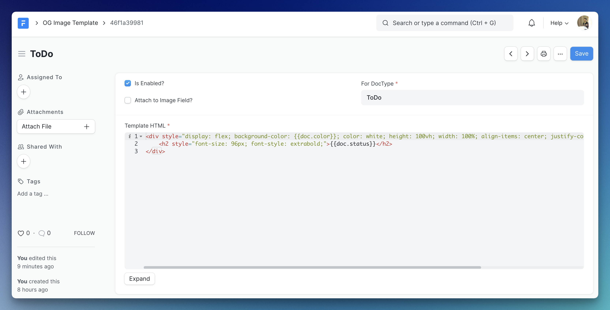
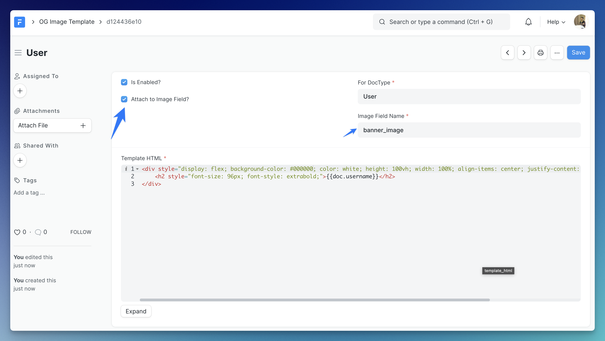

<p align="center">
  <a href="https://github.com/NagariaHussain/frappe_dynamic_og">
    
  </a>
</p>
<h1 style="font-size: 24px" align="center">Dynamically Generate OG Images in your Frappe sites</h1>


## 📋 Features

- [x] Define DocType-wise templates for generating images
- [x] Automatically re-generates images on document changes
- [x] Automatically attach the generated image to a particular field in the document
- [x] Full Inter Font Family supported in the image HTML template
- [x] Automatically delete older image files
- [x] Up to 1920x1080 images (for now.)
- [x] Tests! (yup, I consider it a pretty good feature 😉)

## 📀 Installation

Make sure you have Frappe bench installed. You can install this app on your Frappe site by running:

```bash
bench get-app https://github.com/NagariaHussain/frappe_dynamic_og
bench --site my_site.localhost install-app frappe_dynamic_og
```

This app requires **Node >= 16** and **Frappe Version >= 14**.

## 👩🏼‍💻 Usage

The most important DocType in this app is **OG Image Template**. When you want to generate OG images (well, you can use the generated image for anything you want) for a given DocType, just create a new **OG Image Template** document. For example, if I want to generate an OG image for the `ToDo` DocType, I will set the **For Doctype** field in the form to `ToDo`:



The Template HTML field takes a `jinja` template. The document is available in the content as `doc`, so, in the above template `{{ doc.status }}` will be replaced by the status of the `ToDo` document. We are also using the `color` field of `ToDo` as background color of the generated image.

**The Result:**

https://user-images.githubusercontent.com/34810212/206919225-66016d1a-562c-4fa4-b778-315803ee70ff.mp4

### Attach To Image Field

If you want to attach the generated image to a `Attach Image` type field on the document, you can easily do so by checking the "Attach to Image Field?" checkbox and provide the name for the attach image field in the doctype. For instance, if I want to generate an image for the `User` doctype and attach the image to the **Banner Image** (`banner_image`) field, I only need to do this:



**The Result:**

https://user-images.githubusercontent.com/34810212/206919330-63ecd171-e645-4439-aa06-f9d3bf539073.mp4

## 📍 Planned Features 

- [ ] Delete og image files on trash of document
- [ ] Embed images in OG Images
- [ ] Configurable fonts via Google Fonts
- [ ] Update existing OG images on documents in bulk from OG Template form/API
- [ ] Use something like [this](https://github.com/jonkemp/inline-css) to support style tags instead of manual inline CSS
- [ ] Only update OG image based on fields used in HTML template
- [ ] Live Preview while writing template
- [ ] API to generate OG images dynamically

#### License

[MIT](./LICENSE.txt)